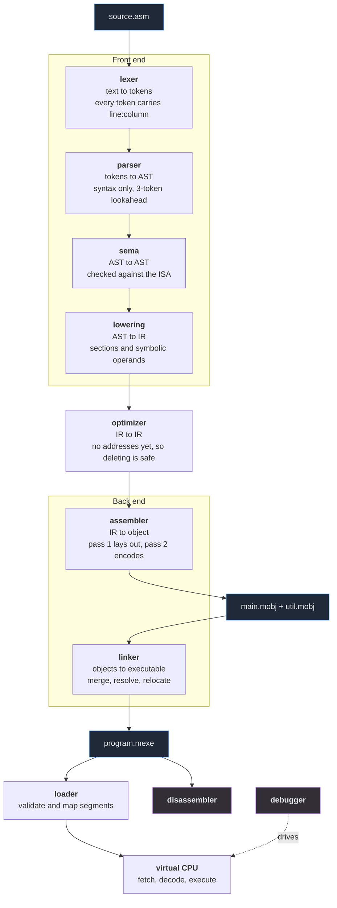
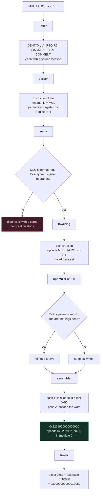
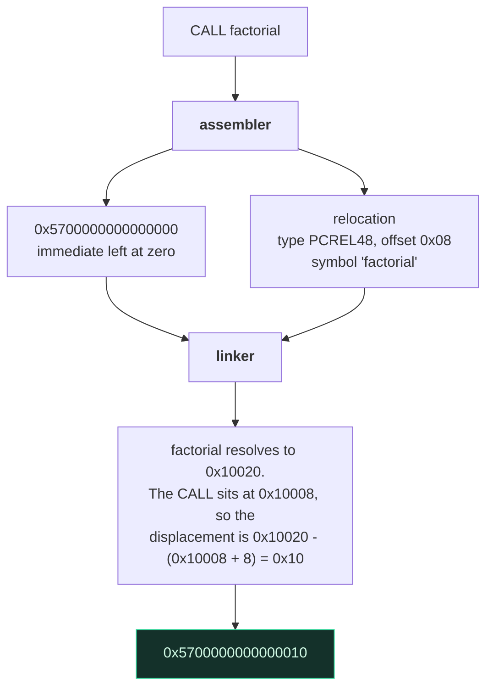

# MiniToolchain

An assembler, linker, virtual machine and debugger for a small 64-bit
instruction set, written from scratch in C++23. No third-party libraries,
not even for the tests.

You write assembly, assemble each file into an object file, link the
objects into an executable, and run it on the VM or step through it in
the debugger. Each of those files has its own binary format, and the
`minitool` command can open every one of them.

```asm
; answer.asm
.section .text
.global _start

_start:
    MOVI R1, 40
    MOVI R2, 2
    ADD  R1, R2
    CALL print_number
    HALT

print_number:
    MOV R14, R1
    RET
```

```console
$ minitool build answer.asm -o answer.mexe
linked 1 object(s) -> answer.mexe (entry 0x10000, 56 bytes of image)

$ minitool disassemble answer.mexe
segment .text at 0x10000 (56 bytes, r-x)

0000000000010000 <_start>:
0000000000010000:  1110000000000028  MOVI R1, 40
0000000000010008:  1120000000000002  MOVI R2, 2
0000000000010010:  2012000000000000  ADD R1, R2
0000000000010018:  5700000000000008  CALL    print_number (0x10028)
0000000000010020:  0100000000000000  HALT

0000000000010028 <print_number>:
0000000000010028:  10E1000000000000  MOV R14, R1
0000000000010030:  5800000000000000  RET

$ minitool run answer.mexe --trace
PC=0x0000000000010000  MOVI R1, 40
PC=0x0000000000010008  MOVI R2, 2
PC=0x0000000000010010  ADD R1, R2
PC=0x0000000000010018  CALL .+8
PC=0x0000000000010028  MOV R14, R1
PC=0x0000000000010030  RET
PC=0x0000000000010020  HALT
```

## What's in it

| Part | What it does |
|---|---|
| Lexer | Hand-written scanner. Every token keeps its line and column. |
| Parser | Recursive descent with three tokens of lookahead. After an error it skips to the next line and keeps going. |
| Semantic analysis | Checks instruction shapes, operand kinds, literal ranges and duplicate labels. |
| IR | Instructions without addresses yet, which is what makes the optimizer safe (see below). |
| Optimizer | Constant folding, dead stores, unreachable code and peepholes, with flag liveness over the control-flow graph. |
| Assembler | Two passes: lay out offsets, then encode and emit relocations. |
| Object format | `.mobj`: sections, symbols, relocations, a line table and a CRC-32. |
| Linker | Merges sections, resolves symbols, assigns addresses and applies five relocation types. |
| Executable format | `.mexe`: a validated memory image plus debug info. |
| Virtual CPU | 16 registers, flags, and a flat address space where every access is bounds- and permission-checked. |
| Syscalls | `exit`, `write`, `read` and `allocate`. |
| Disassembler | Uses the VM's own decoder, so what it prints is exactly what will run. |
| Debugger | Breakpoints, watchpoints, stepping, backtraces and source lines. |
| Playground | A page in the browser that sends your code to the real toolchain and shows what happened. |

About 11,000 lines of C++ and 6,000 lines of tests (358 test cases).

## Building

You need a C++23 compiler: MSVC 19.40+, GCC 13+ or Clang 17+.

### On Windows, with only the Visual Studio Build Tools

```powershell
pwsh tools/build.ps1              # build everything and run the tests
pwsh tools/build.ps1 -NoTests     # build only
pwsh tools/build.ps1 -Filter vm   # run one group of tests
```

No CMake needed. The script finds MSVC through `vswhere` and calls `cl`
directly. It works the same under `powershell` (5.1, built into Windows)
and `pwsh` (7). The programs end up in `build\msvc-release\`.

### With CMake (any platform)

```bash
cmake --preset release
cmake --build build/release
```

To run the tests:

```bash
cmake --preset debug
cmake --build build/debug
ctest --preset debug
```

The `asan` and `ubsan` presets build and test the same way with the
address and undefined-behaviour sanitizers on.

## Commands

```console
minitool build    <src...> -o <exe>    assemble and link in one step
minitool assemble <src>    -o <obj>    assemble one source file
minitool link     <obj...> -o <exe>    link object files
minitool run      <exe>                run a program
minitool disassemble <exe>             print the program as assembly
minitool debug    <exe>                interactive debugger
minitool objdump  <obj>                describe an object file
minitool verify   <exe>                validate an executable
minitool isa                           print the instruction table
minitool decode   <hex-word>           decode one instruction word
minitool bench                         quick benchmark
minitool serve                         browser playground on 127.0.0.1:8080
```

Useful flags: `-O0` / `-O1`, `-g` / `-gno`, `--entry <name>`, `--trace`,
`--stats`, `--max-instructions <n>`, `-x <debugger command>`,
`--port <n>` / `--host <addr>`.

## How it fits together

Every box is a separate module, and every arrow is a data structure you
can look at with the CLI.



Two pieces of code have exactly one copy, because two copies could drift
apart. `isa::decode` is used by the assembler, the disassembler, the
relocation engine and the VM. `isa::evaluateBinary` is used by the VM to
execute arithmetic and by the optimizer to fold constants, so the
optimizer can never compute a different answer than the machine would.

### One instruction, start to finish

Here is `MUL R2, R1` from `examples/factorial.asm` going through every
stage. The offset and the encoding are the real ones; check them with
`minitool decode 2221000000000000`.



### Calling a function

A `CALL` to a label needs one more step. The assembler doesn't know where
the label will end up, so it leaves the field as zero and writes a
**relocation**: a note saying "patch this field once you know the
address". The linker fills it in after every section has an address.



The `+ 8` is the easiest thing in a linker to get wrong: a branch is
relative to the instruction *after* it, not the branch itself. The linker
computes it with `isa::branchDisplacement` and the VM follows it with
`isa::branchTarget`, its inverse, defined right next to it. A test checks
that a patched `CALL` lands exactly where the VM will jump. More in [relocation.md](docs/relocation.md)
and [ADR-007](docs/adr/ADR-007-relocation-model.md).

## The instruction set

A 64-bit load/store machine with 16 general-purpose registers and fixed
8-byte instructions, little-endian everywhere.

```
 63        56 55    52 51    48 47                                        0
+------------+--------+--------+--------------------------------------------+
|   opcode   |  dst   |  src   |          immediate / displacement           |
|   8 bits   | 4 bits | 4 bits |                  48 bits                    |
+------------+--------+--------+--------------------------------------------+
```

36 instructions in seven formats. Any bits an instruction doesn't use
must be zero, and the decoder rejects a word where they aren't. That
means every instruction has exactly one encoding, so
`encode(decode(word)) == word` for every word the decoder accepts. Tests
check this in both directions over random inputs.

Full spec: [isa.md](docs/isa.md). Assembly syntax:
[assembly.md](docs/assembly.md).

## Binary formats

`.mobj` and `.mexe` share a layout: a fixed header with counts and
offsets, fixed-size record tables, a string table and a data blob, with a
CRC-32 over everything after the header.

The readers check every offset, length, index, enum value and reserved
field before using it. One test takes a valid file and corrupts each byte
in turn, one at a time, to make sure none of them can cause an
out-of-bounds read.

The same source always produces the same bytes, and golden files in
`tests/fixtures/` catch any change to that.

See [object-format.md](docs/object-format.md),
[executable-format.md](docs/executable-format.md) and
[relocation.md](docs/relocation.md).

## The optimizer

```console
$ minitool build examples/optimization.asm -o o1.mexe -O1 --stats
examples/optimization.asm: O1 15 -> 5 instructions (1 folded, 2 identities, 2 dead stores, 3 unreachable, 3 peepholes)
```

It runs on the IR, before anything has an address. Branches point at
labels instead of holding displacements, so deleting an instruction can't
break a jump somewhere else. Labels are never deleted. An instruction
that sets flags is only replaced by one that doesn't when a liveness
analysis over the control-flow graph shows nothing reads those flags.

The test for it is simple: a program must behave the same at `-O0` and
`-O1`, down to its output, exit code and every register. That's checked
on hand-written programs, on the eight examples, and on 120 randomly
generated programs.

See [optimizer.md](docs/optimizer.md) and
[ADR-008](docs/adr/ADR-008-optimizer-ir.md).

## The debugger

```console
$ minitool debug factorial.mexe
(minidbg) break factorial
breakpoint 1 at 0x0000000000010020
(minidbg) run
stopped at breakpoint, PC = 0x0000000000010020 (factorial)
(minidbg) backtrace
#0  0x0000000000010020  factorial
#1  0x0000000000010010  _start+16
(minidbg) finish
PC = 0x0000000000010010
(minidbg) print R1
R1 = 0x0000000000375F00 (3628800)
```

That's 10! in `R1`. Besides breakpoints there are watchpoints on memory,
`step` / `next` / `finish`, register and memory dumps, disassembly
around the current instruction, and source-line mapping.

The debugger only uses the VM's public interface and never writes into
the program image, so running under the debugger can't change what the
program computes.

See [debugger.md](docs/debugger.md).

## The playground

```console
$ minitool serve
minitool playground on http://127.0.0.1:8080/  (Ctrl+C to stop)
```

Type assembly on the left and press **Run**. You get the program's
output, any errors with carets under the problem, the disassembly and
the final registers, from the same code path as `minitool build`.

Nothing is compiled in the browser. Doing that in JavaScript would mean
writing a second assembler and VM that could disagree with the real
ones, and WebAssembly would add Emscripten as a build dependency. The
page sends the source to a small local server instead. The server only
listens on 127.0.0.1, because it runs whatever it's sent. Sizes and the
instruction count are capped, and the program runs in the same sandboxed
VM as everything else.

See [playground.md](docs/playground.md) and
[ADR-012](docs/adr/ADR-012-playground-architecture.md).

## Tests

358 test cases, run with a small test runner in `tests/support/` that
uses the same macros as GoogleTest.

| Kind | What it checks |
|---|---|
| Unit | Each component, including how it fails |
| Integration | Source in, program behaviour out, through the whole pipeline |
| Golden | Binary output is byte-for-byte stable |
| Property | `decode(encode(x)) == x`, format round-trips, `-O0` and `-O1` agree |
| Fuzz | Random and corrupted input never crashes, hangs or reads out of bounds |
| Failure | Every documented error happens, with the documented message |

`examples/errors/` has one broken program per kind of mistake, each with
the error it should produce, so the error messages get tested too.

See [testing.md](docs/testing.md).

## Performance

Release build, MSVC 19.44, 11th-gen mobile Intel i7:

| Stage | Throughput |
|---|---|
| Lexer | 242 MB/s |
| Assembler (-O0) | 841 K instructions/s |
| Linker | 9.1 M instructions/s |
| **VM** | **23.7 M instructions/s** |
| Object file read (fully validated) | 214 MB/s |

Nothing has been tuned yet. [performance.md](docs/performance.md) has the
full table, how it was measured, and the two obvious speedups left alone
until a profile says they matter.

## Documentation

| Document | Contents |
|---|---|
| [architecture.md](docs/architecture.md) | Modules, layering and the rules between them |
| [isa.md](docs/isa.md) | The instruction set |
| [assembly.md](docs/assembly.md) | The assembly language |
| [object-format.md](docs/object-format.md) | `.mobj`, byte by byte |
| [executable-format.md](docs/executable-format.md) | `.mexe`, byte by byte |
| [relocation.md](docs/relocation.md) | The five relocation types |
| [linker.md](docs/linker.md) | Merging, resolution, layout |
| [optimizer.md](docs/optimizer.md) | The passes and when each one is allowed to fire |
| [vm.md](docs/vm.md) | The machine and its runtime errors |
| [debugger.md](docs/debugger.md) | Commands and how they work |
| [playground.md](docs/playground.md) | The browser UI and its JSON API |
| [diagnostics.md](docs/diagnostics.md) | Error codes and error recovery |
| [testing.md](docs/testing.md) | How the tests are organised |
| [performance.md](docs/performance.md) | Benchmarks and how they were run |
| [development-log.md](docs/development-log.md) | Bugs found along the way: cause, fix, test |
| [adr/](docs/adr/) | Twelve design decisions and the alternatives considered |

## What it doesn't do

- No floating point, SIMD, atomics or threads.
- No dynamic linking, shared libraries or position-independent code.
- The optimizer has no inlining, no code motion between blocks and no
  register allocation.
- Each section is limited to 960 KiB.

## Ideas for later

1. A register allocator.
2. A native x86-64 backend that reuses the IR and the object format.
3. A JIT for hot loops, measured against the interpreter.
4. ELF output.

## License

MIT. See [LICENSE](LICENSE).
