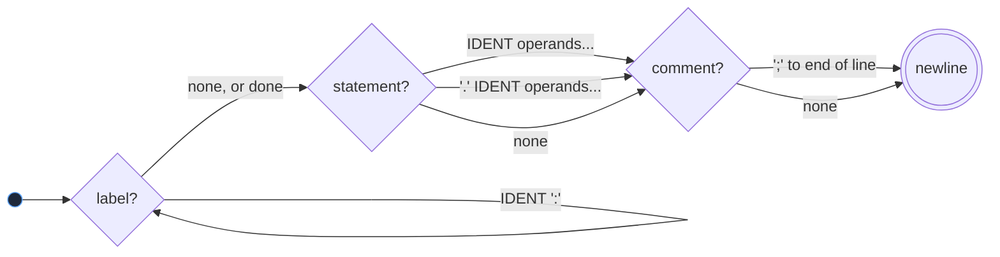
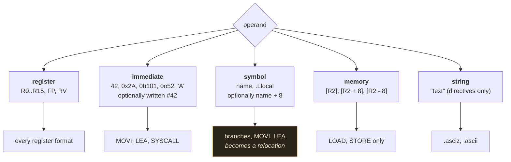

# The MiniToolchain assembly language

> Status: **FROZEN** as of v1.0.0. Changes require an ADR.

The instruction set itself is specified in [isa.md](isa.md); this
document covers the surface syntax: what the lexer and parser accept.

## 1. A complete program

```asm
; hello.asm
.section .rodata

message:
    .asciz "Hello, World!\n"

.section .text

.global _start

_start:
    MOVI R1, 1              ; fd = stdout
    LEA  R2, message        ; buffer address, filled in by the linker
    MOVI R3, 14             ; length
    SYSCALL 1               ; write

    MOVI R1, 0
    SYSCALL 0               ; exit(0)
```

```
minitool build hello.asm -o hello.mexe
minitool run hello.mexe
```

## 2. Lines

A line is:

```
[label:]... [instruction | directive] [; comment]
```



Every part is optional. A line may be nothing but a label, nothing but a
comment, or entirely blank. Labels may share a line with the statement
that follows them, and several may appear together:

```asm
loop: retry: ADD R1, R2
```

## 3. Comments

`;` starts a comment that runs to the end of the line. It is the only
comment syntax; `#` is an operand prefix (§6), not a comment.

## 4. Identifiers and labels

An identifier starts with a letter or `_` and continues with letters,
digits or `_`. It is case-sensitive.

A label is an identifier followed by `:`. It names the current offset in
the current section.

```asm
_start:
main_loop:
_private_helper:
```

A label whose name begins with `.L` is **local**: it never leaves the
object file, so two files may both define `.Lloop` without colliding. A
reference to an undefined local label is an error at assembly time,
because no linker could ever satisfy it.

```asm
.Lloop:
    DEC  R1
    JG   .Lloop
```

## 5. Registers

`R0` through `R15`, case-insensitive. Two ABI aliases are accepted:
`FP` for `R13` and `RV` for `R14`. The disassembler always prints the
canonical `R13` / `R14`.

`R16`, `R01` and similar are not registers; they lex as identifiers, and
using one as an operand produces "expects a register here, found symbol".

## 6. Literals

| Form | Example | Notes |
|---|---|---|
| Decimal | `42`, `-7` | |
| Hexadecimal | `0xFF`, `-0x10` | case-insensitive |
| Binary | `0b1010` | |
| Octal | `0o17` | |
| Character | `'A'`, `'\n'`, `'\x41'` | value is the byte |
| String | `"hi\n"` | directives only |

Escapes in character and string literals: `\n` `\t` `\r` `\0` `\\` `\'`
`\"` and `\xHH`. An unknown escape is an error rather than a silently
copied character.

A literal that does not fit in 64 bits is an error, and so is one that
does not fit the field it is used in. Nothing is ever truncated.

`#` may precede an immediate for readability: `MOVI R1, #10` and
`MOVI R1, 10` are the same instruction.

## 7. Operands

| Kind | Syntax | Used by |
|---|---|---|
| Register | `R7` | most instructions |
| Immediate | `42`, `#42`, `'A'` | `MOVI`, `SYSCALL` |
| Symbol | `message`, `message + 8` | `MOVI`, `LEA`, branches, data |
| Memory | `[R2 + 8]`, `[R2 - 8]`, `[R2]` | `LOAD`, `STORE` |
| String | `"text"` | `.asciz` |

`LOAD` and `STORE` mirror each other, so the memory operand is always on
the side where the data ends up:

```asm
LOAD  R1, [R2 + 8]      ; R1 = mem64[R2 + 8]
STORE [R2 + 8], R1      ; mem64[R2 + 8] = R1
```

## 8. Expressions

A symbol reference may carry a constant addend:

```asm
    LEA  R1, message
    LEA  R2, message + 8
    LEA  R3, message - 4
.qword  table + 16
```

That is the whole expression language: `symbol`, `symbol + constant`,
`symbol - constant`, and plain constants. General expression evaluation
is out of scope. The addend travels into
the relocation, so the linker adds it to the final address.

## 9. Sections

Four sections, each with a fixed role:

| Section | Contents | Permissions |
|---|---|---|
| `.text` | instructions | read + execute |
| `.rodata` | constants, strings | read |
| `.data` | initialised variables | read + write |
| `.bss` | zero-filled space | read + write |

```asm
.section .data          ; the explicit form
.data                   ; shorthand for the same thing
```

A file starts in `.text` if it says nothing. Switching back to a section
appends to it; the sections are concatenated in the canonical order
`.text`, `.rodata`, `.data`, `.bss` whatever order the source used.

Instructions may only appear in `.text`, and initialised data may not
appear in `.bss`. Both are errors that name the section.

## 10. Directives

### Symbols

```asm
.global name[, name...]     ; visible to other object files
.extern name[, name...]     ; defined in another object file
.weak   name[, name...]     ; a definition that a strong one overrides,
                            ; or a reference that resolves to 0 if absent
```

An unknown name used as an operand is treated as external automatically,
so `.extern` is documentation rather than a requirement.

### Data

```asm
.byte   1, 2, 3             ; 1 byte each
.word   0x1234              ; 2 bytes, little-endian
.dword  0xDEADBEEF          ; 4 bytes
.qword  0x1122334455667788  ; 8 bytes
.asciz  "text"              ; the bytes, plus a terminating NUL
.space  64                  ; 64 zero bytes
.space  64, 0xFF            ; 64 bytes of 0xFF
.align  8                   ; pad to an 8-byte boundary
```

`.dword` and `.qword` also accept a symbol, which becomes a relocation:

```asm
pointer:
    .qword message + 1
```

A value that does not fit its directive's width is an error. `.align`
requires a power of two.

## 11. Grammar

```
program     := { line }
line        := { label } [ instruction | directive ] NEWLINE
label       := IDENT ':' | '.' IDENT ':'
instruction := IDENT [ operand { ',' operand } ]
directive   := '.' IDENT [ operand { ',' operand } ]
operand     := register | '#' INTEGER | expr | memory | STRING
memory      := '[' register [ ('+' | '-') INTEGER ] ']'
expr        := INTEGER | CHAR | symbol [ ('+' | '-') INTEGER ]
symbol      := IDENT | '.' IDENT
```

The five operand shapes, and which instructions accept each:



Note that the parser accepts any operand shape anywhere. Whether a given
instruction *permits* it is a semantic question, decided in sema (see
§12).

## 12. What the parser does not decide

The parser builds a syntax tree and stops. It does not know how many
operands an instruction takes, whether a register is valid for it, or
whether a label is defined: those are semantic questions, answered by
`SemanticAnalyzer` (architectural rules 1 and 2).

`HALT R1` is therefore a *semantic* error ("HALT takes 0 operands, but 1
was given"), not a parse error. `MOVI R1, 5 R2` is a parse error, because
no grammar rule can absorb the second register.

## 13. Errors

One mistake does not hide the rest: the parser recovers at the end of the
line and semantic analysis reports everything it finds in one pass.

```
examples/errors/invalid-operand.asm:10:14: error: MOV expects a register here, found immediate
   10 |     MOV  R1, 5          ; MOV is register-to-register; use MOVI
      |              ^
```

See [diagnostics.md](diagnostics.md) for the full catalogue, and
`examples/errors/` for one file per failure mode.
