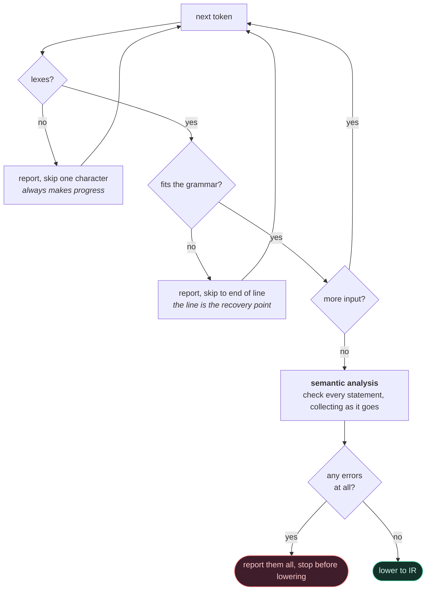
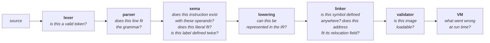

# Diagnostics

Every diagnostic says what is wrong and where, and, when it can, what
would be right instead.

## 1. Anatomy

```
examples/errors/duplicate-label.asm:12:1: error: duplicate label 'loop'
   12 | loop:
      | ^~~~
examples/errors/duplicate-label.asm:10:1: note: previously defined here
   10 | loop:
      | ^~~~
```

* file, line and column, in the standard `file:line:col:` form that every
  editor can jump to;
* severity: `note`, `warning`, `error`, `fatal`;
* the message, naming the thing that is wrong in the user's own words
  (`'loop'`, not "symbol");
* the source line, with a caret underlining exactly the offending span;
* attached notes: here, the other definition, which is the thing you
  actually want to see.

## 2. Design

`DiagnosticEngine` collects diagnostics and renders them. Two properties
matter:

* **It never writes to a stream itself.** It returns text; the caller
  decides where it goes, so tests can check a message without capturing
  stdout.
* **It holds no global state.** It borrows a `SourceManager` and owns its
  own list. Two compilations in the same process cannot interfere, which
  the test suite relies on constantly.

Locations are 16-byte values (`file`, `line`, `column`, `length`), so
carrying one costs nothing and every AST and IR node has one.

## 3. Error codes

Every diagnostic has a stable code, so failures can be classified without
matching on prose. Values are contract: append, never renumber.

| Range | Area |
|---|---|
| 100-199 | front end: lexical, parse, operand, directive |
| 200-299 | symbols and relocation |
| 300-399 | binary formats |
| 400-499 | runtime |
| 500-599 | tooling and I/O |

| Code | Name | Raised when |
|---|---|---|
| 100 | `LEXICAL_ERROR` | a malformed token |
| 101 | `PARSE_ERROR` | the grammar does not accept the line |
| 102 | `INVALID_REGISTER` | a register operand that is not one |
| 103 | `INVALID_OPCODE` | an unknown mnemonic |
| 104 | `INVALID_OPERAND` | wrong count or wrong kind |
| 105 | `INTEGER_OVERFLOW` | a literal that does not fit its field |
| 106 | `INVALID_DIRECTIVE` | unknown directive or bad arguments |
| 200 | `UNDEFINED_SYMBOL` | nothing defines a referenced name |
| 201 | `DUPLICATE_SYMBOL` | two definitions of one name |
| 202 | `RELOCATION_OVERFLOW` | a reference too far to encode |
| 203 | `INVALID_RELOCATION` | a relocation that cannot be applied |
| 204 | `INVALID_SECTION_REFERENCE` | unknown section, or wrong content for one |
| 205 | `SYMBOL_VISIBILITY_CONFLICT` | e.g. `.extern` on a defined symbol |
| 300 | `INVALID_OBJECT` | a `.mobj` that fails validation |
| 301 | `INVALID_EXECUTABLE` | a `.mexe` that fails validation |
| 302 | `UNSUPPORTED_VERSION` | a format version this build does not know |
| 303 | `TRUNCATED_FILE` | the file ends mid-structure |
| 400 | `INVALID_MEMORY_ACCESS` | unmapped or out-of-region access |
| 401 | `ILLEGAL_INSTRUCTION` | undecodable word, misaligned `PC` |
| 402 | `DIVISION_BY_ZERO` | `DIV`/`MOD` by zero |
| 403 | `STACK_OVERFLOW` | past the bottom of the stack |
| 404 | `STACK_UNDERFLOW` | `POP`/`RET` with an empty stack |
| 405 | `PERMISSION_VIOLATION` | write to `r--`, execute from `rw-` |
| 406 | `SYSCALL_ERROR` | a bad system call |
| 500 | `IO_ERROR` | a file could not be read or written |
| 501 | `INTERNAL_ERROR` | a broken invariant: a bug in the toolchain |

## 4. Recovery

One mistake does not hide the rest.

* The **lexer** always makes progress: a malformed token is reported and
  scanning continues, so a stray character cannot cost you the rest of
  the file.
* The **parser** recovers at the end of the line.
* **Semantic analysis** checks every statement, then reports.

```
$ minitool build examples/errors/invalid-operand.asm -o out.mexe
examples/errors/invalid-operand.asm:10:14: error: MOV expects a register here, found immediate
   10 |     MOV  R1, 5          ; MOV is register-to-register; use MOVI
      |              ^
examples/errors/invalid-operand.asm:11:5: error: ADD takes 2 operands, but 1 was given
   11 |     ADD  R1            ; ADD takes two operands
      |     ^~~
examples/errors/invalid-operand.asm:12:14: error: LOAD expects a '[base + disp]' memory operand here, found register
   12 |     LOAD R1, R2         ; LOAD needs a [base + displacement] operand
      |              ^~
```

Three mistakes, three messages, one run.

That depends on recovery. Each stage has a defined point at
which it resynchronises and keeps going, rather than abandoning the file
at the first problem:



The one thing recovery must never do is invent a fact. A statement that
did not parse produces no AST node, so nothing downstream is asked to
reason about a line that was never understood, which is how a cascade of
nonsense follow-on errors is avoided.

## 5. Which stage reports what

A diagnostic should come from the stage that knows enough to explain it,
and no earlier:

| Question | Answered by |
|---|---|
| Is this a valid token? | lexer |
| Does this line fit the grammar? | parser |
| Does this instruction exist, with these operands? | sema |
| Does this literal fit its field? | sema |
| Is this label defined twice in this file? | sema |
| Can this be represented in the IR? | lowering |
| Is this symbol defined anywhere? | linker |
| Does this address fit its relocation field? | linker |
| Is this image loadable? | executable validator |
| What went wrong at run time? | VM |



This is why `HALT R1` is a semantic error and not a parse error: the
parser does not know how many operands `HALT` takes, and should not
(architectural rules 1 and 2). Each stage asks only what it has the
information to answer.

## 6. Runtime errors

The VM reports faults the same way, with the faulting `PC` instead of a
source location:

```
$ minitool run divide.mexe
runtime error: division by zero
  DIV by zero
  PC = 0x0000000000010010, after 3 instructions
```

With debug information the debugger turns that `PC` back into a source
line.

## 7. Testing

`examples/errors/` holds one program per failure mode, each documenting
the diagnostic it should produce.
`Pipeline.ErrorExamplesAllFailWithDiagnostics` asserts every one of them
is rejected, and `tests/failure/test_failure_cases.cpp` asserts on the
message text, because a diagnostic that stops saying the useful part has
regressed, even if it still fails.
