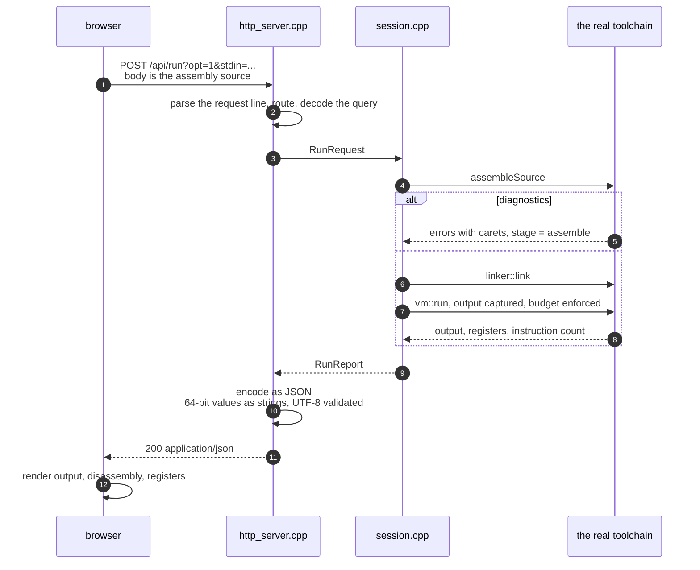

# The playground

A browser front end for the toolchain: type assembly on the left, press
**Run**, and see the program's output, its diagnostics, its disassembly and
its final machine state on the right.

```console
$ minitool serve
minitool playground on http://127.0.0.1:8080/  (Ctrl+C to stop)
```

```console
$ minitool serve --port 9000          # a different port
$ minitool serve --host 0.0.0.0       # reachable from the network; read the warning below
```

## What it is made of



Two endpoints, and that is the whole surface:

| Method | Path | Purpose |
|---|---|---|
| `GET` | `/` | The page. Embedded in the binary; there is no file to serve. |
| `POST` | `/api/run` | Body is the assembly source. Returns a JSON report. |

`/api/run` takes two optional query parameters: `opt=0|1` for the
optimization level, and `stdin=<url-encoded>` for what the program's `read`
syscall should receive.

## Why a server rather than compiling in the browser

The obvious alternative is to port the assembler and VM to JavaScript so the
page works with no backend. That would mean a second implementation of the
lexer, parser, assembler, linker and virtual CPU, which could drift
apart from the C++ one over time.

Architectural rule 9 exists to prevent this: the disassembler shares
`isa::decode` with the VM so it always shows what will actually run, and the
optimizer shares `isa::evaluateBinary` with the execute step so folding always
matches execution. A JavaScript assembler would be a third opinion about
what the ISA means, and the one users would actually see.

So the browser only draws. Every number, message and caret on the page came
out of the same `assembleSource` -> `linker::link` -> `vm::run` sequence that
`minitool build` uses. If the CLI and the playground ever disagree, it is a
bug in one shared component, not a divergence between two implementations.

The cost is that the playground needs a running local process. That is the
right trade for a toolchain whose whole point is that there is one definition
of the machine.

## The two layers

`playground::runSource` (in [session.hpp](../include/minitool/playground/session.hpp))
does the work and knows nothing about HTTP. It takes source text and returns a
`RunReport`: which stage it reached, the rendered diagnostics, the program's
output, the disassembly, the optimizer's statistics and the final registers.
Because it knows nothing about HTTP, the interesting behaviour can be tested
without opening a socket: `test_playground.cpp` calls it directly.

`playground::serve` adds the socket, and `playground::handleRequest` does the
routing and JSON encoding. `handleRequest` is public for the same reason:
routing, argument decoding and JSON escaping are all testable as pure
functions of a method, a target and a body.

## Limits

Every one of these exists because the input is untrusted: a playground
accepts whatever someone types.

| Limit | Value | Why |
|---|---|---|
| Source size | 256 KiB | A request cannot make the server allocate without bound. |
| Request size | 1 MiB | Headers and body together, enforced while reading. |
| Output kept | 256 KiB | A program looping on `write` cannot exhaust memory. |
| Instruction budget | 5,000,000 (max 50,000,000) | A browser is waiting; an endless program must be cut off in well under a second. |

Exceeding the output limit does not stop the program: the extra bytes are
dropped and the report sets `output_truncated`, because truncating is a
display decision rather than a trap.

The program itself runs under the same VM the CLI uses, so it is already
confined: permission-checked memory, no host system calls beyond the four
virtual ones, and no way to reach the filesystem or the network.

## Security

The server binds to **127.0.0.1** by default, and that default matters: the
endpoint compiles and executes submitted code. The VM sandbox bounds what a
submitted program can do (it cannot touch the host's memory, files or
network, and the instruction budget bounds how long it runs), but the process
is still doing work on behalf of whoever can reach the port.

`--host 0.0.0.0` exposes it to the network. Do that only on a network you
control, and never on an untrusted one. There is no authentication, because a
loopback development tool does not need any and adding a half-measure would
suggest otherwise.

The server has no filesystem surface at all: the page is a string compiled
into the binary, so there is no path handling to get wrong and no way to ask
it for a file. `GET /../secrets` is a 404 like anything else that is not one
of the two routes.

## The JSON contract

```json
{
  "ok": true,
  "stage": "finished",
  "diagnostics": "",
  "error": "",
  "output": "Hello, World!\n",
  "output_truncated": false,
  "disassembly": "segment .text at 0x10000 ...",
  "ran": true,
  "exit_code": "0",
  "instructions": "6",
  "pc": "65584",
  "sp": "2147418112",
  "flags": "0",
  "registers": ["0", "0", "2097152", "14", ...],
  "stats": { "total": 0, "summary": "" }
}
```

`stage` is one of `assemble`, `link`, `load`, `execute`, `finished`, and it is
what lets the page say *which* kind of failure happened rather than just that
one did.

**Every 64-bit quantity is a string.** JSON numbers are doubles, so a register
holding more than 2^53 would silently lose its low bits between the server and
the page; a register set to 2^63 would come back as 9223372036854776000. The
page reads them with `BigInt`, which is exact. This is checked by
`PlaygroundHttp.SendsRegistersAsStringsSoTheyKeepEveryBit`.

Strings are escaped as JSON requires, and anything that is not well-formed
UTF-8 is replaced with U+FFFD. A program's output is arbitrary bytes: a lone
`0x80` passed through verbatim would make the browser's `JSON.parse` throw,
which would look like a broken playground rather than a program that printed a
byte which is not text. Overlong encodings and surrogates are rejected on the
same grounds: the server can never emit a string the browser will refuse.

## Testing

`tests/unit/test_playground.cpp`, 24 cases, split between the two layers.

The session tests cover each stage a program can fail at (assembly error with
a caret, link error, runtime trap, budget exhaustion), the limits, `stdin`
delivery, and that `-O0` and `-O1` compute the same answer.

The HTTP tests go through `handleRequest`, covering routing, method checks,
query decoding (`%20` and `+`), the size limit, and the three encoding
properties above: JSON escaping, UTF-8 replacement, and 64-bit precision.

The one thing they do not cover is the socket loop itself: `readRequest`,
`sendAll` and the accept loop are exercised by running the server, not by the
suite. That gap is intentional: testing them would mean a test that binds a
port, and the logic worth testing is all on the other side of `handleRequest`.
