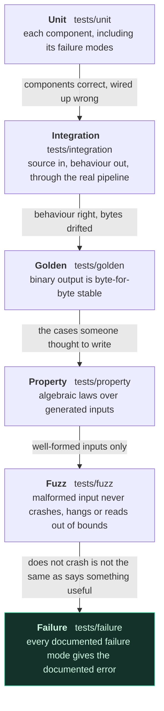

# Testing strategy

358 test cases, with no third-party dependency
([ADR-010](adr/ADR-010-test-framework.md)).

## Running everything

```bash
# CMake, any compiler
cmake --preset debug && cmake --build build/debug && ctest --preset debug
cmake --preset asan  && cmake --build build/asan  && ctest --preset asan
cmake --preset ubsan && cmake --build build/ubsan && ctest --preset ubsan

# Or, with nothing but MSVC installed
pwsh tools/build.ps1
pwsh tools/build.ps1 -Filter optimizer     # one group
```

Tests run with the repository root as the working directory, because some
read `examples/` and `tests/fixtures/`.

## Layers

| Layer | Location | What it proves |
|---|---|---|
| Unit | `tests/unit/` | Each component behaves as specified, including its failure modes. |
| Integration | `tests/integration/` | Source text in, program behaviour out, through the real pipeline. |
| Golden | `tests/golden/` | Binary output is byte-for-byte stable. |
| Property | `tests/property/` | Algebraic laws hold over generated inputs. |
| Fuzz | `tests/fuzz/` | Malformed input never crashes, hangs, or reads out of bounds. |
| Failure | `tests/failure/` | Every documented failure mode produces the documented error. |

Each layer catches a class of bug the ones below it structurally cannot.
The arrows read "would not have caught this":



## What each layer is really for

### Unit tests

One component, its contract, and its failure modes. A unit test that only
checks the happy path is half a test: `test_memory.cpp` spends more
lines on permission violations and region boundaries than on successful
reads.

### Integration tests

The pipeline, end to end. `Pipeline.TheAcceptanceProgramFromThePlan` is
the acceptance program, run exactly as written.
`Pipeline.EveryCheckedInExampleAssemblesLinksAndRuns` builds all eight
examples at both optimization levels and compares the results, so an
example that stops working is a test failure, not a surprise for the next
reader.

### Golden tests

The exact bytes of a `.mobj` and two `.mexe` files are checked in. A
change to them is never silently accepted:

```bash
pwsh tools/generate-fixtures.ps1     # only when the change is intended
```

A failure here is not necessarily a bug, but it is always a decision.

### Property tests

Laws, over generated inputs, with a fixed seed so a failure is
reproducible:

* `decode(encode(i)) == i` for every instruction;
* `encode(decode(w)) == w` for every word the decoder accepts;
* `serialize(deserialize(x)) == serialize(x)` for both formats;
* the same source always assembles to the same bytes;
* **`run(program) == run(optimize(program))`**: the differential test
  that holds the optimizer to its promise, comparing output, exit code,
  every register and the stack pointer over 120 generated programs.

### Fuzz tests

Deterministic pseudo-random input through every parser and loader: the
lexer, the parser, the whole front end, the instruction decoder, both
binary readers, mutations of *valid* files (which reach far deeper than
random bytes), and random code in the VM.

The invariant: malformed input may produce an error,
but must never crash, hang, or invoke undefined behaviour. Two of these
are worth calling out:

* `Fuzz.LexerTerminatesOnAnyInput` asserts progress (at most one token
  per character), so a lexer bug becomes a failed assertion instead of a
  hung suite.
* `Fuzz.DecoderAcceptsOrRejectsEveryWordWithoutCrashing` re-encodes
  everything it accepts, which is how a bijection failure would surface.

Running these under ASan and UBSan is how "no undefined behaviour" gets
checked rather than assumed.

### Failure tests

One test per entry in the failure catalogue, asserting both
that the operation fails *and* that the message still says the useful
part. A diagnostic that regresses to "error" has regressed, even if the
exit code is unchanged.

## Conventions

* **Test names are sentences.** `Vm.TrapsOnWritingToReadOnlyMemory`, not
  `Vm.Test7`. The name should tell you what broke without opening the
  file.
* **Comments say why, not what.** If a test exists because of a specific
  bug, the comment says so (see `Lexer.ParsesNegativeNonDecimalLiterals`).
* **Every bug fix gets a regression test**, named in
  [development-log.md](development-log.md).
* **Tests are not modified to accommodate an implementation bug.** When a
  test and the code disagree, one of them is wrong, and which one is a
  decision that gets written down.

## Sanitizers

```bash
cmake --preset asan  && cmake --build build/asan  && ctest --preset asan
cmake --preset ubsan && cmake --build build/ubsan && ctest --preset ubsan
```

ASan and UBSan matter most for the binary readers and the VM, where the
inputs are untrusted by construction. MSVC supports ASan only; the
GCC/Clang builds cover UBSan and TSan.

## Coverage

```bash
cmake --preset coverage && cmake --build build/coverage && ctest --preset coverage
gcovr -r . --exclude tests/
```

Coverage is a diagnostic, not a target. An uncovered branch is a question
("can this happen?"), and the answer is sometimes "no, and it should be
an assertion instead".
